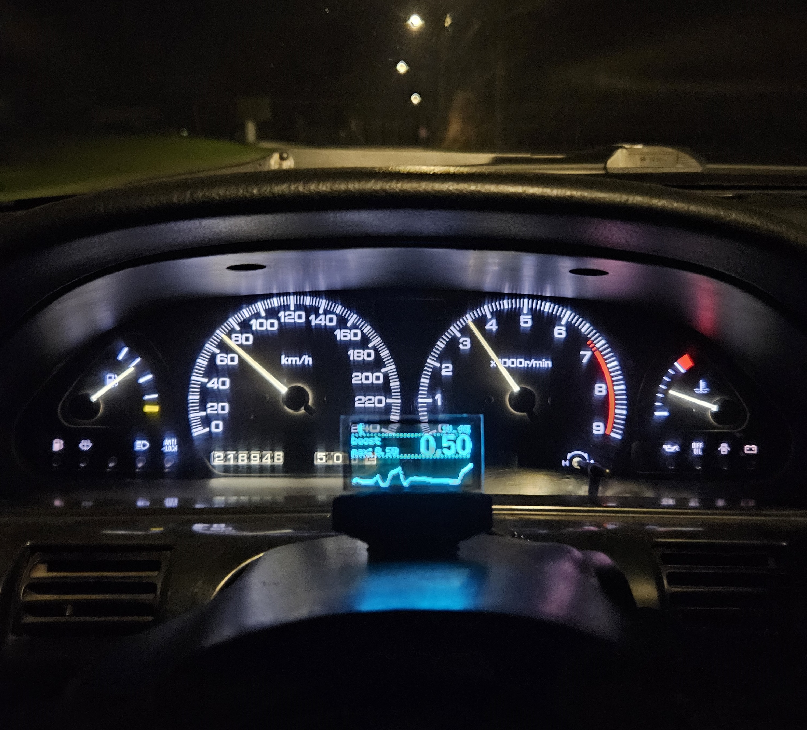

# arduino based boost and AFR gauge with u8g2 monochrome display



## Components used:
- Bosch LSU4.2 Wideband Sensor with wideband controller
- Defi vacuum/boost pressure sensor
  - or any 5V pressure sensor
  - This project is using a -1/2 Bar vacuum/boost pressure sensor
  - See function below for how to set up the code for any sensor.
```cpp
float normaliseSensorData(int m)   //calculate sensorValue
{
  //check: input voltage from arduino, raw value (engine off)
  /*
    Scale the sensor reading into range
    m = measurement to be scaled
    rmin = minimum of the range of the measurement
    rmax = maximum of the range of the measurement
    tmin = minimum of the range of the desired target scaling
    tmax = maximum of the range of the desired target scaling
    normalisedValue = ((m − rmin) / (rmax − rmin)) * (tmax − tmin) + tmin
    https://stats.stackexchange.com/a/281164

    Sensor voltage ranges from 0.273 to 4.827v, converted to analogRead values (0 min, 1023 max) that's 56 to 988
    rmin = 56
    rmax = 988
    
    tmin = 20
    tmax = 2000
    normalisedValue = ((m − 56) / (988 − 56)) * (2000 − 20) + (20)
    normalisedValue = ((m − 56) / 932) * 2000
    normalisedValue = (m − 56) / 0.466

    normalisedValue = ((m - 9) / (921 - 9)) * (3000 - 0) - 0
  */
  return (m-56)/0.466;
}
```
- Fermion: 1.51” OLED Transparent Display SSD1309 128x64
  - see [this list](https://github.com/olikraus/u8g2/wiki/u8g2setupcpp) for all supported displays
- LM2596 (or equivalent) step-down voltage regulator, for converting from the cars battery (12V+) to the microcontroller.
  - Tune the converter to around 7V, even though the microcontroller takes 5V. This is because of the voltage drop from the V_in to the V_out.
- Arduino Mega or equivalent microcontroller. The code is currently using 31902 bytes, which is 98% of the flash memory on a Arduino Uno/Micro. So you could technically run it on an Uno/Micro.

### Code structure:
- main.ino
  - initializes screen, timers, filtering, sensor reads
  - main loop
    - reads sensors
    - filters input
    - stores sensor values
    - creates graphics on screen
    - reset timers
- kalman.cpp
  - filtering
- graphics.cpp
  - functions for different screen graphics
- sensorread.cpp
  - sensor related functions
- tests.h
  - unit testing
